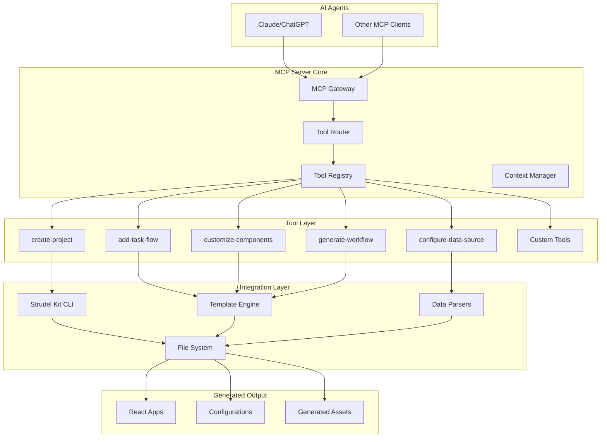
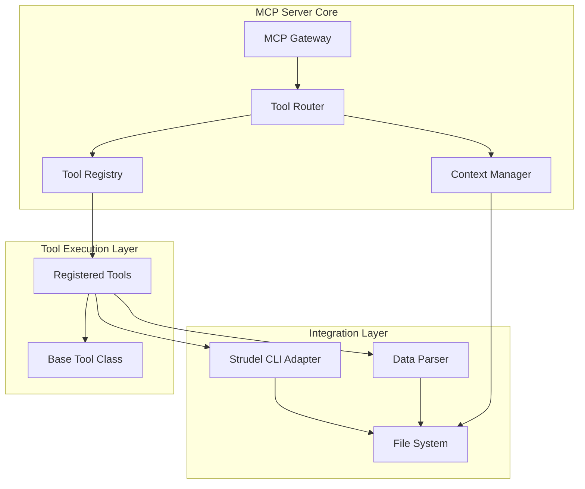
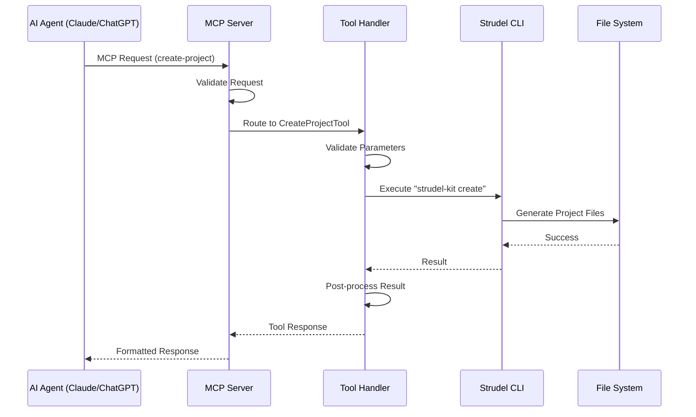

# Strudel Kit MCP Server Architecture Document

## Introduction

This document outlines the overall project architecture for Strudel Kit MCP Server, including backend systems, shared services, and non-UI specific concerns. Its primary goal is to serve as the guiding architectural blueprint for AI-driven development, ensuring consistency and adherence to chosen patterns and technologies.

**Relationship to Frontend Architecture:**
If the project includes a significant user interface, a separate Frontend Architecture Document will detail the frontend-specific design and MUST be used in conjunction with this document. Core technology stack choices documented herein (see "Tech Stack") are definitive for the entire project, including any frontend components.

### Starter Template or Existing Project

N/A

### Change Log

| Date | Version | Description | Author |
|------|---------|-------------|--------|
| 2025-09-19 | 1.0 | Initial architecture document | Winston (AI Architect) |

## High Level Architecture

### Technical Summary

The Strudel Kit MCP Server follows a microservices-inspired architecture built on the xmcp TypeScript framework. The system is designed as a Model Context Protocol (MCP) server that exposes scientific UI development capabilities through auto-discovered tools. Key components include a tool registry/router, integration layer with the Strudel Kit CLI, and data parsing services for scientific formats. The architecture emphasizes extensibility through a plugin system and follows event-driven patterns for asynchronous operations.

The primary technology choices include Node.js 18+ with TypeScript 5.0+, the xmcp framework for MCP compliance, and integration with the Strudel Kit CLI for frontend generation. This architecture directly supports the PRD goals of reducing development time for scientific UIs and eliminating technical barriers for researchers.

### High Level Overview

The architecture follows a modular service style built around the xmcp framework. The repository structure uses a monorepo approach with logical separation of concerns. The primary user interaction flow involves AI agents sending MCP requests to the server, which routes them to appropriate tools that interact with the Strudel Kit CLI and file system to generate scientific applications.

Key architectural decisions include:
1. Using the xmcp framework as the foundation for MCP compliance
2. Implementing auto-discovery for custom tools in the `src/tools/` directory
3. Integrating with the Strudel Kit CLI as a subprocess for frontend generation
4. Supporting multiple scientific data formats (CSV, JSON, HDF5, NetCDF) through dedicated parsers

### High Level Project Diagram



### Architectural and Design Patterns

- **MCP-Compliant Server Pattern:** Using the xmcp framework to implement the Model Context Protocol - _Rationale:_ Aligns with the core requirement to build an MCP server that can integrate with AI agents like Claude and ChatGPT.

- **Auto-Discovery Pattern:** Tools in `src/tools/` are automatically registered - _Rationale:_ Supports the extensibility requirement and enables developers to easily add custom scientific tools without complex configuration.

- **Subprocess Integration Pattern:** Using child processes to execute the Strudel Kit CLI - _Rationale:_ Provides isolation between the MCP server and CLI operations while leveraging existing tooling for frontend generation.

- **Plugin Architecture Pattern:** Support for custom tools through a plugin system - _Rationale:_ Enables community-driven extensions and domain-specific tools without modifying the core server.

## Tech Stack

### Development MCP Servers

The following MCP servers are recommended for developing the Strudel Kit MCP Server:

| MCP Server | Purpose | Rationale |
|------------|---------|-----------|
| **@modelcontextprotocol/server-filesystem** | File operations and project structure management | Essential for tool auto-discovery, CLI integration, and generated output handling |
| **@modelcontextprotocol/server-git** | Version control operations | Required for project collaboration and version management |
| **@modelcontextprotocol/server-typescript** | TypeScript compilation and type checking | Core requirement for TypeScript 5.0+ development and strict mode compliance |
| **@modelcontextprotocol/server-vitest** | Testing framework support | Supports the 80% coverage requirement with native TypeScript and ESM support |
| **@modelcontextprotocol/server-eslint** | Code linting and style enforcement | Enforces Airbnb TypeScript style guide and coding standards |
| **@modelcontextprotocol/server-npm** | Package management | Manages scientific data parsing libraries (CSV, JSON, HDF5, NetCDF) |
| **@modelcontextprotocol/server-subprocess** | Child process management | Critical for Strudel CLI integration via subprocess execution |
| **@modelcontextprotocol/server-markdown** | Documentation maintenance | Supports architecture documentation and README management |
| **@modelcontextprotocol/server-mermaid** | Diagram generation | Maintains architectural diagrams and component visualizations |

### Cloud Infrastructure

- **Provider:** N/A (Self-hosted/Developer machine)
- **Key Services:** N/A
- **Deployment Regions:** N/A

### Technology Stack Table

| Category | Technology | Version | Purpose | Rationale |
|----------|------------|---------|---------|-----------|
| **Language** | TypeScript | 5.0+ | Primary development language | Strong typing, excellent tooling, aligns with Strudel Kit |
| **Runtime** | Node.js | 18.x | JavaScript runtime | LTS version, wide ecosystem, required by xmcp |
| **Framework** | xmcp | latest | MCP framework | Core requirement for building MCP servers |
| **Web Framework** | Express.js | 4.x | HTTP server | Provided by xmcp, lightweight and well-known |
| **Data Formats** | CSV/JSON/HDF5/NetCDF parsers | latest | Scientific data parsing | Required for configure-data-source tool |
| **Testing** | Vitest | latest | Testing framework | Native TypeScript support, faster execution, ESM-first design |
| **Build Tool** | ESBuild/SWC | latest | Compilation | Fast compilation, used by xmcp |
| **Development** | Hot Module Replacement | latest | Development experience | Required for hot reloading support |

## Data Models

### Project Model

**Purpose:** Represents a generated scientific application project

**Key Attributes:**
- projectId: string - Unique identifier for the project
- projectName: string - Name given to the project
- path: string - File system path to the project
- createdAt: Date - Timestamp when project was created
- tools: string[] - List of tools added to the project
- dataSources: object[] - Connected data sources with metadata

**Relationships:**
- One project can have multiple data sources
- One project can have multiple task flows
- One project is associated with one configuration

### DataSource Model

**Purpose:** Represents a connected scientific data source

**Key Attributes:**
- sourceId: string - Unique identifier for the data source
- projectId: string - Reference to the project
- type: enum - Format type (CSV, JSON, HDF5, NetCDF)
- path: string - Path to the data file or API endpoint
- schema: object - Inferred schema from the data
- connectionDetails: object - Additional connection parameters
- lastConnected: Date - Timestamp of last successful connection

**Relationships:**
- One data source belongs to one project
- One data source can be used by multiple components

## Components

### MCP Gateway Component

**Responsibility:** Entry point for all MCP requests from AI agents

**Key Interfaces:**
- JSON-RPC 2.0 compliant endpoint
- Request validation and routing

**Dependencies:** Tool Router, Security Middleware

**Technology Stack:** Express.js (via xmcp), TypeScript

### Tool Registry Component

**Responsibility:** Auto-discovery and registration of MCP tools

**Key Interfaces:**
- Tool registration API
- Tool lookup by name

**Dependencies:** File System utilities

**Technology Stack:** TypeScript, Node.js fs module

### Tool Router Component

**Responsibility:** Route incoming MCP requests to appropriate tools

**Key Interfaces:**
- Request routing logic
- Tool execution interface

**Dependencies:** Tool Registry, Context Manager

**Technology Stack:** TypeScript, xmcp framework

### Strudel CLI Adapter Component

**Responsibility:** Interface with the Strudel Kit CLI for frontend generation

**Key Interfaces:**
- Project creation API
- Task flow addition API
- Component customization API

**Dependencies:** Child process management, File System

**Technology Stack:** TypeScript, Node.js child_process module

### Data Parser Component

**Responsibility:** Parse and validate scientific data formats

**Key Interfaces:**
- Data parsing API for different formats
- Schema inference API

**Dependencies:** Format-specific parsing libraries

**Technology Stack:** TypeScript, specialized parsing libraries for CSV/JSON/HDF5/NetCDF

### Context Manager Component

**Responsibility:** Manage execution context for tool operations

**Key Interfaces:**
- Context creation and disposal
- State management during tool execution

**Dependencies:** File System, Tool Registry

**Technology Stack:** TypeScript

### Component Diagrams



## External APIs

### Strudel Kit CLI API

- **Purpose:** Generate and modify Strudel Kit applications
- **Documentation:** https://github.com/strudel-science/strudel-kit
- **Base URL(s):** Executed as subprocess commands
- **Authentication:** N/A (local execution)
- **Rate Limits:** Limited by system resources

**Key Endpoints Used:**
- `npx strudel-kit create` - Create new projects
- `npx strudel-kit add-flow` - Add task flows to existing projects
- `npx strudel-kit customize` - Modify component properties

**Integration Notes:** The CLI is executed as a child process with specific parameters based on MCP tool requests. Results are captured and processed by the server.

## Core Workflows



## Source Tree

```
strudel-kit-mcp-server/
├── src/
│   ├── server.ts              // Main server entry point
│   ├── core/
│   │   ├── registry.ts        // Tool auto-discovery & registration
│   │   ├── router.ts          // MCP request routing
│   │   ├── context.ts         // Execution context management
│   │   └── validator.ts       // Input/output validation
│   ├── middleware/
│   │   ├── auth.ts            // Optional authentication
│   │   ├── logging.ts         // Request/response logging
│   │   ├── rateLimit.ts       // Rate limiting
│   │   └── error.ts           // Error handling
│   ├── tools/
│   │   ├── base.tool.ts       // Abstract tool class
│   │   ├── create-project.ts
│   │   ├── add-task-flow.ts
│   │   ├── customize-components.ts
│   │   ├── configure-data-source.ts
│   │   └── generate-workflow.ts
│   ├── integrations/
│   │   ├── strudel/
│   │   │   ├── cli.ts         // CLI wrapper
│   │   │   ├── components.ts  // Component registry
│   │   │   └── templates.ts   // Template management
│   │   └── data/
│   │       ├── parsers.ts     // CSV, JSON, HDF5, NetCDF
│   │       └── validators.ts  // Schema validation
│   └── utils/
│       ├── fileSystem.ts      // File operations
│       ├── process.ts         // Child process management
│       └── cache.ts           // Response caching
├── docs/                      // Documentation
├── tests/                     // Unit and integration tests
├── config/                    // Configuration files
└── package.json               // Project configuration
```

## Infrastructure and Deployment

### Infrastructure as Code

- **Tool:** N/A (Simple deployment)
- **Location:** N/A
- **Approach:** Standard Node.js deployment

### Deployment Strategy

- **Strategy:** Single command deployment with zero configuration
- **CI/CD Platform:** N/A (Developer machine deployment)
- **Pipeline Configuration:** N/A

### Environments

- **Development:** Local development environment - Used for building and testing tools
- **Production:** End user machines - Where researchers run the server to generate applications

### Environment Promotion Flow

```
Development -> User Installation
```

### Rollback Strategy

- **Primary Method:** Version pinning in package.json
- **Trigger Conditions:** Failed tool execution, CLI errors
- **Recovery Time Objective:** Immediate (restart server)

## Error Handling Strategy

### General Approach

- **Error Model:** Exception-based with structured error responses
- **Exception Hierarchy:** BaseMCPError -> SpecificErrorTypes
- **Error Propagation:** Through tool execution chain with context preservation

### Logging Standards

- **Library:** Winston (via xmcp)
- **Format:** JSON with timestamp, level, message, and context
- **Levels:** error, warn, info, debug
- **Required Context:**
  - Correlation ID: UUID generated per request
  - Service Context: Tool name and version
  - User Context: Project ID when applicable

### Error Handling Patterns

#### External API Errors

- **Retry Policy:** Exponential backoff for CLI operations
- **Circuit Breaker:** N/A (local CLI execution)
- **Timeout Configuration:** 30 seconds for CLI commands
- **Error Translation:** Map CLI errors to user-friendly messages

#### Business Logic Errors

- **Custom Exceptions:** ToolValidationError, ProjectCreationError, DataSourceError
- **User-Facing Errors:** Structured JSON responses with error codes
- **Error Codes:** PROJECT_EXISTS, INVALID_TOOL_PARAMS, DATA_PARSE_ERROR

#### Data Consistency

- **Transaction Strategy:** N/A (File system operations)
- **Compensation Logic:** Rollback file operations on failure
- **Idempotency:** Tools designed to be idempotent where possible

## Coding Standards

### Core Standards

- **Languages & Runtimes:** TypeScript 5.7+, Node.js 20.x (LTS)
- **Style & Linting:** ESLint 9.x with Airbnb TypeScript style guide, Prettier 3.x for formatting
- **Test Organization:** Tests colocated with implementation files using `__tests__` subdirectories or `*.test.ts` naming convention
```

### Critical Rules

- **Tool Implementation:** All tools must extend BaseMCPTool class
- **Error Handling:** All tool methods must handle errors gracefully
- **Async Operations:** Use async/await consistently
- **File Operations:** Use provided fileSystem utilities, not direct fs calls

### Language-Specific Guidelines

- **TypeScript Specifics:**
  - **Interfaces:** Use interfaces for data structures
  - **Types:** Use types for unions and primitives
  - **Strict Mode:** Enable all strict TypeScript compiler options

## Test Strategy and Standards

### Testing Philosophy

- **Approach:** Test-after development with focus on integration testing
- **Coverage Goals:** 80% code coverage minimum
- **Test Pyramid:** 70% unit tests, 25% integration tests, 5% end-to-end tests

### Test Types and Organization

#### Unit Tests

- **Framework:** Vitest
- **File Convention:** `*.test.ts` alongside implementation
- **Location:** Same directory as source files
- **Mocking Library:** Vitest built-in mocks
- **Coverage Requirement:** 80% per tool

**AI Agent Requirements:**
- Generate tests for all public methods
- Cover edge cases and error conditions
- Follow AAA pattern (Arrange, Act, Assert)
- Mock all external dependencies

#### Integration Tests

- **Scope:** Tool execution with mocked file system
- **Location:** `tests/integration/`
- **Test Infrastructure:**
  - **File System:** In-memory file system mock
  - **Strudel CLI:** Mocked CLI responses
  - **Data Parsers:** Mocked parser outputs

#### End-to-End Tests

- **Framework:** Vitest with real file system
- **Scope:** Complete tool workflows
- **Environment:** Temporary directories
- **Test Data:** Generated test projects

### Test Data Management

- **Strategy:** Generate test data programmatically
- **Fixtures:** `tests/fixtures/` directory
- **Factories:** Factory functions for common objects
- **Cleanup:** Vitest afterEach hooks for cleanup

### Continuous Testing

- **CI Integration:** Run on every git push
- **Performance Tests:** N/A for this project type
- **Security Tests:** npm audit in CI pipeline

## Security

### Input Validation

- **Validation Library:** Joi (via xmcp)
- **Validation Location:** At tool boundaries
- **Required Rules:**
  - All external inputs MUST be validated
  - Validation at API boundary before processing
  - Whitelist approach preferred over blacklist

### Authentication & Authorization

- **Auth Method:** Optional JWT middleware
- **Session Management:** Stateless JWT tokens
- **Required Patterns:**
  - Token validation before tool execution
  - Role-based access control for tools

### Secrets Management

- **Development:** .env files (gitignored)
- **Production:** Environment variables
- **Code Requirements:**
  - NEVER hardcode secrets
  - Access via configuration service only
  - No secrets in logs or error messages

### API Security

- **Rate Limiting:** Express-rate-limit middleware
- **CORS Policy:** Restrict to localhost in development
- **Security Headers:** Helmet.js middleware
- **HTTPS Enforcement:** Required in production

### Data Protection

- **Encryption at Rest:** N/A (User's local files)
- **Encryption in Transit:** HTTPS for remote deployments
- **PII Handling:** No PII processed by default
- **Logging Restrictions:** No sensitive data in logs

### Dependency Security

- **Scanning Tool:** npm audit
- **Update Policy:** Monthly dependency updates
- **Approval Process:** Review audit reports before updates

### Security Testing

- **SAST Tool:** ESLint security plugin
- **DAST Tool:** N/A (No public web interface)
- **Penetration Testing:** Annual third-party review

## Checklist Results Report

To be completed after review with the Product Owner.

## Next Steps

After completing the architecture:

1. If project has UI components:
   - Use "Frontend Architecture Mode"
   - Provide this document as input

2. For all projects:
   - Review with Product Owner
   - Begin story implementation with Dev agent
   - Set up infrastructure with DevOps agent

3. Specific prompts for next agents if needed:
   - For Frontend Architect: "Create frontend architecture for Strudel Kit MCP Server based on this backend architecture, focusing on React/TypeScript implementation with Strudel Kit components"