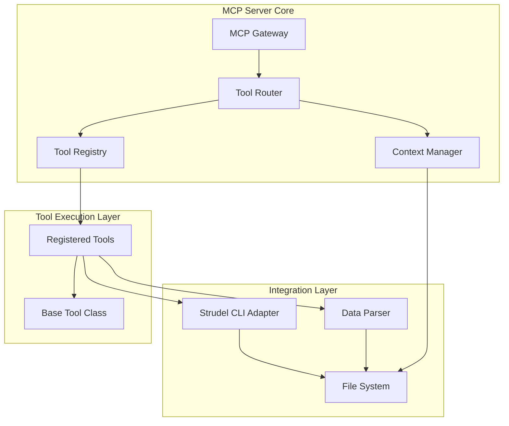

# Components

## MCP Gateway Component

**Responsibility:** Entry point for all MCP requests from AI agents

**Key Interfaces:**
- JSON-RPC 2.0 compliant endpoint
- Request validation and routing

**Dependencies:** Tool Router, Security Middleware

**Technology Stack:** Express.js (via xmcp), TypeScript

## Tool Registry Component

**Responsibility:** Auto-discovery and registration of MCP tools

**Key Interfaces:**
- Tool registration API
- Tool lookup by name

**Dependencies:** File System utilities

**Technology Stack:** TypeScript, Node.js fs module

## Tool Router Component

**Responsibility:** Route incoming MCP requests to appropriate tools

**Key Interfaces:**
- Request routing logic
- Tool execution interface

**Dependencies:** Tool Registry, Context Manager

**Technology Stack:** TypeScript, xmcp framework

## Strudel CLI Adapter Component

**Responsibility:** Interface with the Strudel Kit CLI for frontend generation

**Key Interfaces:**
- Project creation API
- Task flow addition API
- Component customization API

**Dependencies:** Child process management, File System

**Technology Stack:** TypeScript, Node.js child_process module

## Data Parser Component

**Responsibility:** Parse and validate scientific data formats

**Key Interfaces:**
- Data parsing API for different formats
- Schema inference API

**Dependencies:** Format-specific parsing libraries

**Technology Stack:** TypeScript, specialized parsing libraries for CSV/JSON/HDF5/NetCDF

## Context Manager Component

**Responsibility:** Manage execution context for tool operations

**Key Interfaces:**
- Context creation and disposal
- State management during tool execution

**Dependencies:** File System, Tool Registry

**Technology Stack:** TypeScript

## Component Diagrams

