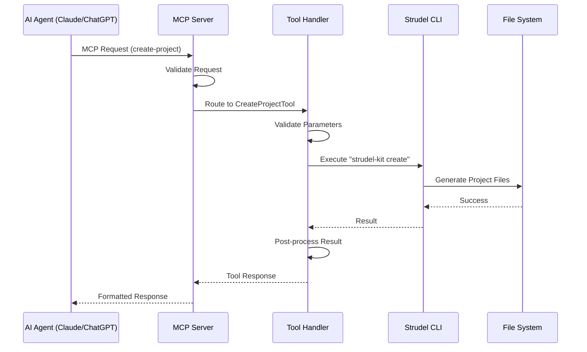

# Core Workflows

```mermaid
sequenceDiagram
    participant AI as AI Agent (Claude/ChatGPT)
    participant MCP as MCP Server
    participant Tool as Tool Handler
    participant CLI as Strudel CLI
    participant FS as File System

    AI->>MCP: MCP Request (create-project)
    MCP->>MCP: Validate Request
    MCP->>Tool: Route to CreateProjectTool
    Tool->>Tool: Validate Parameters
    Tool->>CLI: Execute "strudel-kit create"
    CLI->>FS: Generate Project Files
    FS-->>CLI: Success
    CLI-->>Tool: Result
    Tool->>Tool: Post-process Result
    Tool-->>MCP: Tool Response
    MCP-->>AI: Formatted Response
```
