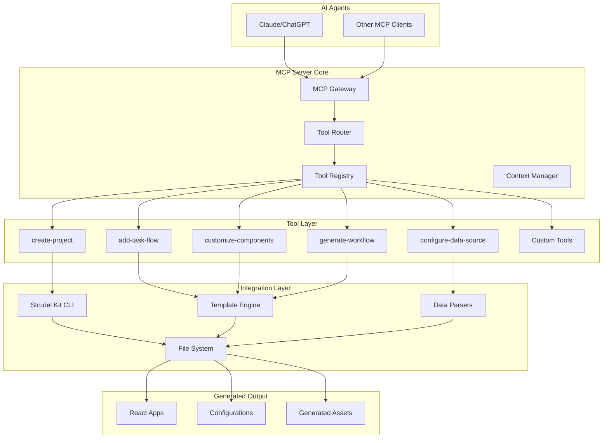

# High Level Architecture

## Technical Summary

The Strudel Kit MCP Server follows a microservices-inspired architecture built on the xmcp TypeScript framework. The system is designed as a Model Context Protocol (MCP) server that exposes scientific UI development capabilities through auto-discovered tools. Key components include a tool registry/router, integration layer with the Strudel Kit CLI, and data parsing services for scientific formats. The architecture emphasizes extensibility through a plugin system and follows event-driven patterns for asynchronous operations.

The primary technology choices include Node.js 18+ with TypeScript 5.0+, the xmcp framework for MCP compliance, and integration with the Strudel Kit CLI for frontend generation. This architecture directly supports the PRD goals of reducing development time for scientific UIs and eliminating technical barriers for researchers.

## High Level Overview

The architecture follows a modular service style built around the xmcp framework. The repository structure uses a monorepo approach with logical separation of concerns. The primary user interaction flow involves AI agents sending MCP requests to the server, which routes them to appropriate tools that interact with the Strudel Kit CLI and file system to generate scientific applications.

Key architectural decisions include:
1. Using the xmcp framework as the foundation for MCP compliance
2. Implementing auto-discovery for custom tools in the `src/tools/` directory
3. Integrating with the Strudel Kit CLI as a subprocess for frontend generation
4. Supporting multiple scientific data formats (CSV, JSON, HDF5, NetCDF) through dedicated parsers

## High Level Project Diagram

## Architectural and Design Patterns

- **MCP-Compliant Server Pattern:** Using the xmcp framework to implement the Model Context Protocol - _Rationale:_ Aligns with the core requirement to build an MCP server that can integrate with AI agents like Claude and ChatGPT.

- **Auto-Discovery Pattern:** Tools in `src/tools/` are automatically registered - _Rationale:_ Supports the extensibility requirement and enables developers to easily add custom scientific tools without complex configuration.

- **Subprocess Integration Pattern:** Using child processes to execute the Strudel Kit CLI - _Rationale:_ Provides isolation between the MCP server and CLI operations while leveraging existing tooling for frontend generation.

- **Plugin Architecture Pattern:** Support for custom tools through a plugin system - _Rationale:_ Enables community-driven extensions and domain-specific tools without modifying the core server.
