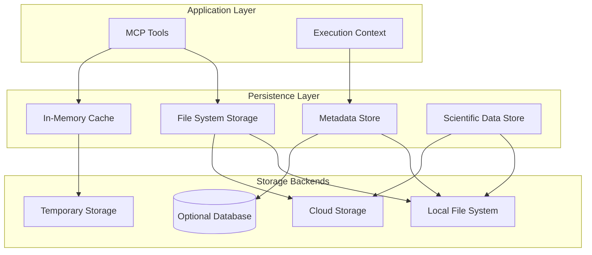

# Data Persistence Strategy

**Version**: 1.0
**Date**: September 19, 2025
**Status**: Implementation Guide

## Overview

The Strudel Kit MCP Server employs a **hybrid persistence strategy** optimized for scientific tool operations. Given the stateless nature of most MCP tools and the temporary nature of many operations, the approach emphasizes lightweight, file-based persistence with optional database integration for advanced use cases.

## Core Persistence Philosophy

### Primary Principles

1. **Stateless by Default**: Most tool operations require no persistent state
2. **File-First Approach**: Generated projects and configurations stored as files
3. **Minimal Database Overhead**: Avoid database complexity for simple operations
4. **Scalable Evolution**: Support future database integration without refactoring
5. **Scientific Data Compatibility**: Handle large datasets efficiently

### Persistence Layers



## File System Persistence (Primary)

### Project Storage Structure

```
/projects/
├── project-{uuid}/
│   ├── metadata.json          # Project metadata
│   ├── src/                   # Generated source code
│   ├── data/                  # Project data files
│   ├── config/                # Configuration files
│   └── .mcp/
│       ├── generation.log     # Creation history
│       ├── tools.json         # Tool execution history
│       └── cache/             # Tool-specific cache
```

### Metadata Format

```typescript
interface ProjectMetadata {
  id: string;
  name: string;
  domain: string;
  created: string;
  lastModified: string;
  version: string;
  generator: {
    tool: string;
    version: string;
    timestamp: string;
    input: any;
  };
  components: {
    name: string;
    type: string;
    path: string;
    dependencies: string[];
  }[];
  dataConnections: {
    id: string;
    type: 'csv' | 'json' | 'hdf5' | 'netcdf';
    source: string;
    schema?: any;
  }[];
  status: 'generating' | 'ready' | 'error';
}
```

### File System Operations

```typescript
// Core file system persistence manager
export class FileSystemPersistence {
  private readonly basePath: string;

  constructor(basePath: string = './data/projects') {
    this.basePath = basePath;
  }

  async saveProject(project: ProjectMetadata): Promise<void> {
    const projectPath = path.join(this.basePath, `project-${project.id}`);
    await fs.mkdir(projectPath, { recursive: true });

    const metadataPath = path.join(projectPath, 'metadata.json');
    await fs.writeFile(metadataPath, JSON.stringify(project, null, 2));
  }

  async loadProject(projectId: string): Promise<ProjectMetadata | null> {
    const metadataPath = path.join(this.basePath, `project-${projectId}`, 'metadata.json');

    try {
      const content = await fs.readFile(metadataPath, 'utf-8');
      return JSON.parse(content);
    } catch (error) {
      if (error.code === 'ENOENT') return null;
      throw error;
    }
  }

  async listProjects(): Promise<ProjectMetadata[]> {
    const projects: ProjectMetadata[] = [];
    const entries = await fs.readdir(this.basePath, { withFileTypes: true });

    for (const entry of entries) {
      if (entry.isDirectory() && entry.name.startsWith('project-')) {
        const projectId = entry.name.replace('project-', '');
        const project = await this.loadProject(projectId);
        if (project) projects.push(project);
      }
    }

    return projects;
  }

  async deleteProject(projectId: string): Promise<void> {
    const projectPath = path.join(this.basePath, `project-${projectId}`);
    await fs.rmdir(projectPath, { recursive: true });
  }
}
```

## In-Memory Caching

### Cache Strategy

```typescript
// LRU cache for frequently accessed data
export class MCPCache {
  private cache: Map<string, CacheEntry>;
  private readonly maxSize: number;
  private readonly defaultTTL: number;

  constructor(maxSize = 1000, defaultTTL = 300000) {
    // 5 minutes
    this.cache = new Map();
    this.maxSize = maxSize;
    this.defaultTTL = defaultTTL;
  }

  set(key: string, value: any, ttl?: number): void {
    const entry: CacheEntry = {
      value,
      expiry: Date.now() + (ttl || this.defaultTTL),
      accessCount: 0,
      lastAccessed: Date.now(),
    };

    // Implement LRU eviction
    if (this.cache.size >= this.maxSize) {
      this.evictLeastRecentlyUsed();
    }

    this.cache.set(key, entry);
  }

  get(key: string): any | undefined {
    const entry = this.cache.get(key);

    if (!entry) return undefined;

    if (Date.now() > entry.expiry) {
      this.cache.delete(key);
      return undefined;
    }

    entry.accessCount++;
    entry.lastAccessed = Date.now();

    return entry.value;
  }

  private evictLeastRecentlyUsed(): void {
    let oldestKey = '';
    let oldestTime = Date.now();

    for (const [key, entry] of this.cache) {
      if (entry.lastAccessed < oldestTime) {
        oldestTime = entry.lastAccessed;
        oldestKey = key;
      }
    }

    if (oldestKey) {
      this.cache.delete(oldestKey);
    }
  }
}

interface CacheEntry {
  value: any;
  expiry: number;
  accessCount: number;
  lastAccessed: number;
}
```

### Cache Usage Patterns

```typescript
// Tool execution context with caching
export class ToolExecutionContext {
  private cache: MCPCache;
  private persistence: FileSystemPersistence;

  async cacheToolOutput(toolName: string, input: any, output: any): Promise<void> {
    const cacheKey = this.generateCacheKey(toolName, input);
    this.cache.set(cacheKey, output, 600000); // 10 minutes
  }

  async getCachedOutput(toolName: string, input: any): Promise<any | undefined> {
    const cacheKey = this.generateCacheKey(toolName, input);
    return this.cache.get(cacheKey);
  }

  private generateCacheKey(toolName: string, input: any): string {
    const inputHash = this.hashObject(input);
    return `tool:${toolName}:${inputHash}`;
  }

  private hashObject(obj: any): string {
    return crypto.createHash('md5').update(JSON.stringify(obj)).digest('hex');
  }
}
```

## Scientific Data Persistence

### Data Format Handling

```typescript
// Scientific data persistence manager
export class ScientificDataStore {
  private readonly dataPath: string;

  constructor(dataPath: string = './data/scientific') {
    this.dataPath = dataPath;
  }

  async storeDataset(
    projectId: string,
    datasetId: string,
    format: 'csv' | 'json' | 'hdf5' | 'netcdf',
    data: any,
    metadata?: any,
  ): Promise<string> {
    const datasetPath = path.join(this.dataPath, projectId, `${datasetId}.${format}`);
    await fs.mkdir(path.dirname(datasetPath), { recursive: true });

    switch (format) {
      case 'csv':
        await this.saveCSV(datasetPath, data);
        break;
      case 'json':
        await fs.writeFile(datasetPath, JSON.stringify(data, null, 2));
        break;
      case 'hdf5':
        await this.saveHDF5(datasetPath, data);
        break;
      case 'netcdf':
        await this.saveNetCDF(datasetPath, data);
        break;
    }

    // Store metadata separately
    if (metadata) {
      const metadataPath = datasetPath + '.meta.json';
      await fs.writeFile(metadataPath, JSON.stringify(metadata, null, 2));
    }

    return datasetPath;
  }

  async loadDataset(datasetPath: string): Promise<{ data: any; metadata?: any }> {
    const format = path.extname(datasetPath).slice(1) as 'csv' | 'json' | 'hdf5' | 'netcdf';
    let data: any;

    switch (format) {
      case 'csv':
        data = await this.loadCSV(datasetPath);
        break;
      case 'json':
        const content = await fs.readFile(datasetPath, 'utf-8');
        data = JSON.parse(content);
        break;
      case 'hdf5':
        data = await this.loadHDF5(datasetPath);
        break;
      case 'netcdf':
        data = await this.loadNetCDF(datasetPath);
        break;
    }

    // Load metadata if available
    const metadataPath = datasetPath + '.meta.json';
    let metadata: any;
    try {
      const metaContent = await fs.readFile(metadataPath, 'utf-8');
      metadata = JSON.parse(metaContent);
    } catch {
      // Metadata file doesn't exist or invalid
    }

    return { data, metadata };
  }

  private async saveCSV(filePath: string, data: any[]): Promise<void> {
    // Implementation for CSV writing
    const headers = Object.keys(data[0] || {});
    const rows = [headers.join(',')];

    for (const item of data) {
      const row = headers.map((header) => {
        const value = item[header];
        // Escape CSV values properly
        return typeof value === 'string' && value.includes(',')
          ? `"${value.replace(/"/g, '""')}"`
          : value;
      });
      rows.push(row.join(','));
    }

    await fs.writeFile(filePath, rows.join('\n'));
  }

  private async loadCSV(filePath: string): Promise<any[]> {
    // Implementation for CSV parsing
    const content = await fs.readFile(filePath, 'utf-8');
    const lines = content.split('\n').filter((line) => line.trim());

    if (lines.length === 0) return [];

    const headers = lines[0].split(',');
    const data = [];

    for (let i = 1; i < lines.length; i++) {
      const values = lines[i].split(',');
      const item: any = {};

      headers.forEach((header, index) => {
        item[header.trim()] = values[index]?.trim();
      });

      data.push(item);
    }

    return data;
  }

  private async saveHDF5(filePath: string, data: any): Promise<void> {
    // Placeholder for HDF5 implementation
    // Would use libraries like h5py-wasm or similar
    throw new Error('HDF5 support not implemented yet');
  }

  private async loadHDF5(filePath: string): Promise<any> {
    throw new Error('HDF5 support not implemented yet');
  }

  private async saveNetCDF(filePath: string, data: any): Promise<void> {
    throw new Error('NetCDF support not implemented yet');
  }

  private async loadNetCDF(filePath: string): Promise<any> {
    throw new Error('NetCDF support not implemented yet');
  }
}
```

## Optional Database Integration

### Database Schema (Future Enhancement)

```sql
-- Optional database schema for advanced use cases
CREATE TABLE IF NOT EXISTS projects (
    id UUID PRIMARY KEY,
    name VARCHAR(255) NOT NULL,
    domain VARCHAR(50),
    created_at TIMESTAMP DEFAULT CURRENT_TIMESTAMP,
    updated_at TIMESTAMP DEFAULT CURRENT_TIMESTAMP,
    metadata JSONB,
    status VARCHAR(20) DEFAULT 'ready'
);

CREATE TABLE IF NOT EXISTS tool_executions (
    id UUID PRIMARY KEY,
    project_id UUID REFERENCES projects(id),
    tool_name VARCHAR(100) NOT NULL,
    input_hash VARCHAR(64),
    output_data JSONB,
    execution_time INTEGER,
    created_at TIMESTAMP DEFAULT CURRENT_TIMESTAMP,

    INDEX idx_project_tool (project_id, tool_name),
    INDEX idx_input_hash (input_hash)
);

CREATE TABLE IF NOT EXISTS data_connections (
    id UUID PRIMARY KEY,
    project_id UUID REFERENCES projects(id),
    name VARCHAR(255) NOT NULL,
    type VARCHAR(20) NOT NULL,
    source_path TEXT,
    schema_info JSONB,
    created_at TIMESTAMP DEFAULT CURRENT_TIMESTAMP
);
```

### Database Adapter Pattern

```typescript
// Database adapter interface for future implementation
export interface DatabaseAdapter {
  saveProject(project: ProjectMetadata): Promise<void>;
  loadProject(projectId: string): Promise<ProjectMetadata | null>;
  listProjects(filters?: ProjectFilters): Promise<ProjectMetadata[]>;
  deleteProject(projectId: string): Promise<void>;

  logToolExecution(execution: ToolExecution): Promise<void>;
  getToolExecutions(projectId: string): Promise<ToolExecution[]>;

  saveDataConnection(connection: DataConnection): Promise<void>;
  getDataConnections(projectId: string): Promise<DataConnection[]>;
}

// PostgreSQL implementation (future)
export class PostgreSQLAdapter implements DatabaseAdapter {
  // Implementation details
}

// SQLite implementation (lightweight option)
export class SQLiteAdapter implements DatabaseAdapter {
  // Implementation details
}
```

## Persistence Configuration

### Configuration Options

```typescript
interface PersistenceConfig {
  strategy: 'file-only' | 'file-with-cache' | 'file-with-database';
  fileSystem: {
    basePath: string;
    compression: boolean;
    encryption: boolean;
  };
  cache: {
    enabled: boolean;
    maxSize: number;
    defaultTTL: number;
  };
  database?: {
    adapter: 'postgresql' | 'sqlite' | 'mongodb';
    connectionString: string;
    poolSize?: number;
  };
  cleanup: {
    tempFileTTL: number; // milliseconds
    projectRetention: number; // days
    automaticCleanup: boolean;
  };
}

// Default configuration
export const defaultPersistenceConfig: PersistenceConfig = {
  strategy: 'file-with-cache',
  fileSystem: {
    basePath: './data',
    compression: false,
    encryption: false,
  },
  cache: {
    enabled: true,
    maxSize: 1000,
    defaultTTL: 300000, // 5 minutes
  },
  cleanup: {
    tempFileTTL: 3600000, // 1 hour
    projectRetention: 30, // 30 days
    automaticCleanup: true,
  },
};
```

### Environment-Based Configuration

```typescript
// Load persistence configuration from environment
export function loadPersistenceConfig(): PersistenceConfig {
  return {
    strategy: (process.env.PERSISTENCE_STRATEGY as any) || 'file-with-cache',
    fileSystem: {
      basePath: process.env.DATA_PATH || './data',
      compression: process.env.ENABLE_COMPRESSION === 'true',
      encryption: process.env.ENABLE_ENCRYPTION === 'true',
    },
    cache: {
      enabled: process.env.CACHE_ENABLED !== 'false',
      maxSize: parseInt(process.env.CACHE_MAX_SIZE || '1000'),
      defaultTTL: parseInt(process.env.CACHE_TTL || '300000'),
    },
    database: process.env.DATABASE_URL
      ? {
          adapter: (process.env.DB_ADAPTER as any) || 'postgresql',
          connectionString: process.env.DATABASE_URL,
          poolSize: parseInt(process.env.DB_POOL_SIZE || '10'),
        }
      : undefined,
    cleanup: {
      tempFileTTL: parseInt(process.env.TEMP_FILE_TTL || '3600000'),
      projectRetention: parseInt(process.env.PROJECT_RETENTION_DAYS || '30'),
      automaticCleanup: process.env.AUTO_CLEANUP !== 'false',
    },
  };
}
```

## Performance and Scalability

### File System Optimization

```typescript
// Optimized file operations with streaming
export class OptimizedFileStore {
  async streamLargeFile(filePath: string): Promise<NodeJS.ReadableStream> {
    return fs.createReadStream(filePath, {
      highWaterMark: 64 * 1024, // 64KB chunks
    });
  }

  async writeStreamToFile(stream: NodeJS.ReadableStream, filePath: string): Promise<void> {
    const writeStream = fs.createWriteStream(filePath);

    return new Promise((resolve, reject) => {
      stream.pipe(writeStream);
      writeStream.on('finish', resolve);
      writeStream.on('error', reject);
    });
  }

  async compressFile(filePath: string): Promise<string> {
    const compressedPath = filePath + '.gz';
    const gzip = zlib.createGzip();
    const source = fs.createReadStream(filePath);
    const destination = fs.createWriteStream(compressedPath);

    return new Promise((resolve, reject) => {
      source.pipe(gzip).pipe(destination);
      destination.on('finish', () => resolve(compressedPath));
      destination.on('error', reject);
    });
  }
}
```

### Memory Management

```typescript
// Memory-efficient data processing
export class MemoryEfficientProcessor {
  async processLargeDataset(
    datasetPath: string,
    processor: (chunk: any[]) => Promise<void>,
    chunkSize: number = 1000,
  ): Promise<void> {
    const stream = fs.createReadStream(datasetPath);
    let buffer = '';
    let lineCount = 0;
    let chunk: any[] = [];

    stream.on('data', (data: Buffer) => {
      buffer += data.toString();
      const lines = buffer.split('\n');
      buffer = lines.pop() || ''; // Keep incomplete line

      for (const line of lines) {
        if (line.trim()) {
          chunk.push(this.parseLine(line));
          lineCount++;

          if (chunk.length >= chunkSize) {
            processor(chunk);
            chunk = [];
          }
        }
      }
    });

    stream.on('end', async () => {
      if (chunk.length > 0) {
        await processor(chunk);
      }
    });
  }

  private parseLine(line: string): any {
    // Parse CSV/JSON line efficiently
    return JSON.parse(line);
  }
}
```

## Backup and Recovery

### Backup Strategy

```typescript
export class BackupManager {
  async createBackup(projectId: string): Promise<string> {
    const projectPath = path.join(this.basePath, `project-${projectId}`);
    const backupPath = path.join(this.backupPath, `backup-${projectId}-${Date.now()}.tar.gz`);

    // Create compressed backup
    const tar = require('tar');
    await tar.create(
      {
        gzip: true,
        file: backupPath,
      },
      [projectPath],
    );

    return backupPath;
  }

  async restoreBackup(backupPath: string, projectId: string): Promise<void> {
    const restorePath = path.join(this.basePath, `project-${projectId}`);

    // Extract backup
    const tar = require('tar');
    await tar.extract({
      file: backupPath,
      cwd: this.basePath,
    });
  }

  async schedulePeriodicBackup(projectId: string, intervalHours: number = 24): Promise<void> {
    setInterval(
      async () => {
        try {
          await this.createBackup(projectId);
          this.logger.info(`Backup created for project ${projectId}`);
        } catch (error) {
          this.logger.error(`Backup failed for project ${projectId}`, error);
        }
      },
      intervalHours * 60 * 60 * 1000,
    );
  }
}
```

This persistence strategy provides a robust, scalable foundation that starts simple and can evolve with project needs while maintaining excellent performance for scientific data operations.
