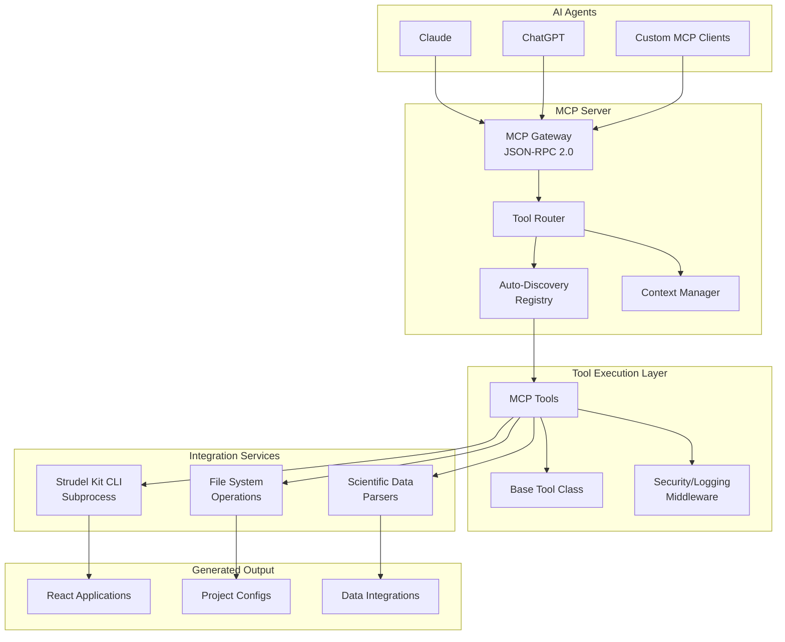

# Product Requirements Document

## Strudel Kit MCP Server

**Version**: 2.0
**Date**: September 19, 2025
**Status**: Architecture-Aligned

---

## 1. Product Overview

### 1.1 Product Description

The Strudel Kit MCP Server is a GitHub-first open source developer tool that transforms scientific UI development from weeks of specialized programming into conversational AI interactions. Built on the xmcp TypeScript framework, it delivers a production-ready Model Context Protocol (MCP) server that makes scientific application development accessible to researchers worldwide through auto-discoverable tools and seamless CLI integration.

### 1.2 Value Proposition

- **Reduce Development Time**: From weeks to hours for scientific UI creation through AI-driven tool execution
- **Eliminate Technical Barriers**: No web development expertise required - natural language suffices
- **Maintain Control**: Researchers retain full ownership of generated code and deployment choices
- **Community-Driven**: Open source model with plugin architecture enables rapid domain-specific extensions
- **Developer Experience First**: Hot reloading, auto-discovery, and comprehensive error handling

---

## 2. Problem Statement

### 2.1 Current State

Scientific researchers currently face significant barriers when developing research applications:

- Steep learning curves for modern web development stacks (React, TypeScript, build tools)
- Weeks of development time for basic scientific UIs with proper data integration
- Limited resources for hiring specialized full-stack developers
- Fragmented tooling across different scientific domains with no cohesive ecosystem
- Complex configuration management and deployment processes

### 2.2 Target Opportunity

Enable 100,000+ scientific researchers globally to create sophisticated research applications through natural language interaction with AI agents, democratizing access to modern UI development capabilities while maintaining professional development standards.

---

## 3. Goals and Objectives

### 3.1 Primary Goals

- **P0**: Deliver production-ready MCP server with complete Strudel Kit CLI integration
- **P0**: Enable zero-configuration setup with auto-discovery of custom tools
- **P0**: Support all scientific task flows through context-aware MCP tools
- **P0**: Achieve 30-minute time-to-first-application with 90% success rate
- **P1**: Foster community adoption with 1,000+ GitHub stars within 6 months
- **P2**: Enable ecosystem of domain-specific extensions through plugin architecture

### 3.2 Success Criteria

- **Developer Experience**: < 5 minutes setup time, hot reloading, comprehensive error messages
- **Technical Requirements**: 80% test coverage, TypeScript strict mode, Vitest framework
- **User Experience**: Zero web development knowledge requirement for basic use cases
- **Community Health**: Active weekly contributions, responsive issue resolution (< 72h P0, < 1 week P1)
- **Performance**: < 500ms tool execution, < 30s production builds, < 1GB data processing

---

## 4. User Requirements

### 4.1 Target Users

**Primary Persona: Research Scientist**

- **Background**: PhD in scientific field, minimal programming experience
- **Need**: Create data visualization and analysis interfaces quickly
- **Pain Points**: Current tools require extensive web development knowledge and weeks of learning
- **Success Metric**: Generate functional application in under 30 minutes
- **Tools Used**: Claude, ChatGPT, VS Code with MCP integration

**Secondary Persona: Research Software Engineer**

- **Background**: Strong programming experience, scientific domain knowledge
- **Need**: Rapidly prototype scientific applications and extend functionality
- **Pain Points**: Repetitive boilerplate code, slow iteration cycles, complex build configurations
- **Success Metric**: 10x productivity improvement for UI development, easy custom tool creation
- **Tools Used**: Full MCP ecosystem, custom tool development, CI/CD integration

**Tertiary Persona: Platform Developer**

- **Background**: Full-stack developer building scientific platforms
- **Need**: Integrate scientific UI generation into larger systems
- **Pain Points**: API inconsistencies, limited customization, deployment complexity
- **Success Metric**: Seamless integration with existing platforms, enterprise-grade security

### 4.2 User Stories

| Priority | User Story                                                                                         | Acceptance Criteria                                                                                             |
| -------- | -------------------------------------------------------------------------------------------------- | --------------------------------------------------------------------------------------------------------------- |
| P0       | As a researcher using Claude, I want to create a new scientific application with one MCP tool call | Tool generates complete project structure with Strudel Kit components and data integration                      |
| P0       | As a researcher, I want to add data visualization workflows through natural language               | "Add temperature trend visualization for NetCDF data" creates functional component with proper schema inference |
| P0       | As a researcher, I want to connect scientific datasets without coding                              | Tool handles CSV, JSON, HDF5, NetCDF formats with automatic schema validation and error recovery                |
| P0       | As a developer, I want custom tools auto-discovered without configuration                          | New TypeScript file in `src/tools/` extending BaseMCPTool automatically registers and becomes available         |
| P1       | As a researcher, I want to customize UI components for my domain                                   | Natural language modifications to Strudel Kit components with theme and layout adjustments                      |
| P1       | As a platform team, I want to deploy applications with enterprise security                         | JWT middleware, CORS configuration, rate limiting, and HTTPS enforcement available                              |
| P2       | As a team lead, I want to manage user access and project collaboration                             | Role-based access control, project sharing, and team management through MCP tools                               |

---

## 5. Functional Requirements

### 5.1 Core MCP Tools

#### 5.1.1 create-project

- **Description**: Generate new Strudel Kit applications with complete project scaffolding
- **Inputs**: Project name, scientific domain, UI patterns, data source types
- **Outputs**: Complete project scaffold with package.json, TypeScript config, Strudel Kit dependencies
- **Integration**: Strudel Kit CLI subprocess execution with error handling and progress tracking
- **Validation**: Project name uniqueness, dependency compatibility, directory permissions

#### 5.1.2 add-task-flow

- **Description**: Integrate scientific workflows into existing projects with data binding
- **Supported Flows**:
  - explore-data: Interactive dataset browsers with filtering and search
  - compare-data: Multi-dataset comparison tools with statistical analysis
  - contribute-data: Research data submission portals with validation
  - monitor-activities: Real-time monitoring dashboards with alerting
  - run-computation: Scientific computing interfaces with job management
  - search-data-repositories: Database search tools with federated queries
- **Inputs**: Task flow type, project context, configuration parameters, data source mappings
- **Outputs**: Integrated React components with proper TypeScript definitions and data bindings
- **Error Handling**: Graceful degradation, rollback on failure, detailed error messages

#### 5.1.3 customize-components

- **Description**: Modify scientific UI components with theme and layout control
- **Capabilities**:
  - Component property modification with type validation
  - Theme customization (colors, typography, spacing)
  - Layout adjustments (grid systems, responsive design)
  - Accessibility compliance (ARIA labels, keyboard navigation)
- **Component Library**: Full Strudel Kit component access with documentation integration
- **Validation**: Component compatibility, theme consistency, accessibility standards

#### 5.1.4 configure-data-source

- **Description**: Connect scientific datasets with automatic schema inference and validation
- **Supported Formats**: CSV, JSON, HDF5, NetCDF with extensible parser architecture
- **Connection Types**: File upload, REST API integration, real-time WebSocket streams
- **Features**:
  - Automatic schema inference with confidence scoring
  - Data validation with detailed error reporting
  - Connection health monitoring and retry logic
  - Data transformation pipelines for format normalization
- **Security**: Input sanitization, file size limits, malicious content detection

#### 5.1.5 generate-workflow

- **Description**: Create multi-step analysis pipelines with dependency management
- **Features**:
  - Workflow orchestration with DAG visualization
  - Step dependency management and parallel execution
  - Export capabilities (JSON, YAML, visual diagrams)
  - Version control integration for workflow evolution
- **Output**: Complete workflow configuration with UI components and execution engine
- **Integration**: Compatible with existing scientific computing frameworks (Jupyter, Dask)

### 5.2 Framework Architecture Requirements

| Component           | Description                                       | Priority | Implementation                                                     |
| ------------------- | ------------------------------------------------- | -------- | ------------------------------------------------------------------ |
| Tool Registry       | Auto-discovery of tools in `src/tools/` directory | P0       | File system scanning, TypeScript reflection, hot reloading support |
| MCP Gateway         | JSON-RPC 2.0 compliant request handling           | P0       | Express.js middleware, request validation, response formatting     |
| Context Manager     | Execution context for stateful tool operations    | P0       | Project state management, cleanup handlers, error boundaries       |
| CLI Integration     | Strudel Kit CLI subprocess management             | P0       | Child process wrapper, output parsing, error translation           |
| Data Parser Engine  | Extensible parsing for scientific formats         | P0       | Plugin architecture, schema inference, validation pipeline         |
| Security Middleware | Authentication, authorization, rate limiting      | P1       | JWT handling, CORS configuration, request sanitization             |
| Caching Layer       | Response caching and optimization                 | P1       | In-memory cache, TTL management, cache invalidation                |

### 5.3 Development Tools Integration

| Tool Category          | Requirement                                              | Implementation                                           | Priority |
| ---------------------- | -------------------------------------------------------- | -------------------------------------------------------- | -------- |
| TypeScript Support     | Strict mode compliance, full type definitions            | TSConfig with strict settings, comprehensive .d.ts files | P0       |
| Testing Framework      | Vitest with 80% coverage minimum                         | Unit, integration, and E2E test suites                   | P0       |
| Code Quality           | ESLint with Airbnb TypeScript rules, Prettier formatting | Automated linting, pre-commit hooks                      | P0       |
| Development Experience | Hot reloading, source maps, debugging support            | HMR integration, development middleware                  | P0       |
| Build System           | Fast compilation with ESBuild/SWC                        | Production builds < 30 seconds                           | P0       |
| Documentation          | API documentation generation, example integration        | JSDoc extraction, interactive examples                   | P1       |

---

## 6. Non-Functional Requirements

### 6.1 Performance

- **Tool Execution**: < 500ms for simple tools, < 5s for complex operations (project creation)
- **Build Performance**: < 30 seconds for production builds, < 100ms hot reload updates
- **Memory Usage**: < 512MB baseline, handle 1GB datasets efficiently
- **Concurrent Operations**: Support 100+ simultaneous tool executions per server instance

### 6.2 Scalability

- **Horizontal Scaling**: Stateless architecture supporting load balancing
- **Tool Capacity**: Handle 1000+ custom tools without performance degradation
- **Data Processing**: Streaming support for datasets larger than available memory
- **Community Growth**: Architecture supporting 10,000+ developers building custom tools

### 6.3 Security

- **Input Validation**: Comprehensive validation using Joi schemas at all boundaries
- **Authentication**: Optional JWT middleware with role-based access control
- **Data Privacy**: No telemetry collection without explicit opt-in consent
- **Dependency Security**: Automated npm audit integration, monthly security updates
- **Secrets Management**: Environment variable configuration, no hardcoded credentials
- **API Security**: Rate limiting, CORS policies, security headers (Helmet.js)

### 6.4 Reliability

- **Error Handling**: Structured error hierarchy with context preservation
- **Fault Tolerance**: Circuit breaker patterns for external service calls
- **Data Consistency**: Atomic file operations with rollback capabilities
- **Logging**: Structured JSON logging with correlation IDs and context
- **Health Monitoring**: Service health endpoints and dependency checks

### 6.5 Usability

- **Setup Experience**: Zero-config installation, < 5 minutes to running server
- **Documentation**: 100% public API coverage with interactive examples
- **Error Messages**: Clear, actionable guidance with suggested fixes
- **Developer Experience**: Comprehensive TypeScript definitions, intellisense support
- **Community Support**: GitHub discussions, issue templates, contribution guidelines

### 6.6 Compatibility

- **Runtime Requirements**: Node.js 18+ (LTS support), TypeScript 5.0+
- **MCP Compliance**: Full JSON-RPC 2.0 specification adherence
- **Operating Systems**: Windows, macOS, Linux with consistent behavior
- **AI Platform Integration**: Claude, ChatGPT, and other MCP-compatible clients
- **Browser Support**: Chrome, Firefox, Safari, Edge (latest 2 versions) for generated UIs

---

## 7. Technical Architecture

### 7.1 Technology Stack

```
Core Framework:
- xmcp TypeScript Framework (MCP server foundation)
- Node.js 18+ (LTS runtime)
- Express.js 4.x (HTTP server via xmcp)

Development Stack:
- TypeScript 5.0+ (strict mode, comprehensive typing)
- Vitest (testing framework with native TS support)
- ESLint + Prettier (Airbnb TypeScript style guide)
- ESBuild/SWC (fast compilation)

Integration Layer:
- Strudel Kit CLI (subprocess integration)
- Scientific Data Parsers (CSV, JSON, HDF5, NetCDF)
- File System Operations (project scaffolding)

Generated Applications:
- React 18+ (UI framework)
- Strudel Kit Component Library (scientific components)
- TypeScript 5.0+ (type-safe applications)
```

### 7.2 Repository Structure

```
strudel-kit-mcp-server/
├── src/
│   ├── server.ts                    # Main server entry point
│   ├── core/
│   │   ├── registry.ts             # Tool auto-discovery & registration
│   │   ├── router.ts               # MCP request routing
│   │   ├── context.ts              # Execution context management
│   │   └── validator.ts            # Input/output validation
│   ├── middleware/
│   │   ├── auth.ts                 # JWT authentication
│   │   ├── logging.ts              # Structured logging
│   │   ├── rateLimit.ts           # Rate limiting
│   │   └── error.ts                # Error handling
│   ├── tools/                      # MCP tools (auto-discovered)
│   │   ├── base.tool.ts           # Abstract base class
│   │   ├── create-project.ts       # Project creation
│   │   ├── add-task-flow.ts        # Workflow integration
│   │   ├── customize-components.ts # UI customization
│   │   ├── configure-data-source.ts# Data connection
│   │   └── generate-workflow.ts    # Pipeline creation
│   ├── integrations/
│   │   ├── strudel/               # Strudel Kit integration
│   │   │   ├── cli.ts             # CLI wrapper
│   │   │   ├── components.ts      # Component registry
│   │   │   └── templates.ts       # Template management
│   │   └── data/                  # Data processing
│   │       ├── parsers.ts         # Format parsers
│   │       └── validators.ts      # Schema validation
│   └── utils/
│       ├── fileSystem.ts          # File operations
│       ├── process.ts             # Child process management
│       └── cache.ts               # Response caching
├── .agents/                       # Hidden documentation workspace (architecture, PRD shards, stories, QA)
│   ├── architecture/              # Architecture shards
│   ├── stories/                   # Epic and story specs
│   ├── prd/                       # PRD shards
│   ├── qa/                        # QA records and gates
│   └── *.md                       # Top-level indices (architecture.md, prd.md, etc.)
├── tests/                         # Test suites
│   ├── unit/                      # Unit tests
│   ├── integration/               # Integration tests
│   └── e2e/                       # End-to-end tests
├── config/                        # Configuration files
└── package.json                   # Project configuration
```

### 7.3 Integration Architecture



---

## 8. Success Metrics

### 8.1 Technical Metrics

| Metric                    | Baseline | 30 Days | 90 Days | 180 Days |
| ------------------------- | -------- | ------- | ------- | -------- |
| Test Coverage             | 80%      | 85%     | 90%     | 95%      |
| Build Success Rate        | 95%      | 98%     | 99%     | 99.5%    |
| Tool Execution Time (p95) | <500ms   | <400ms  | <300ms  | <250ms   |
| Memory Usage (baseline)   | <512MB   | <400MB  | <350MB  | <300MB   |
| Hot Reload Performance    | <100ms   | <75ms   | <50ms   | <25ms    |

### 8.2 Adoption Metrics

| Metric                 | Target (30 days) | Target (90 days) | Target (180 days) |
| ---------------------- | ---------------- | ---------------- | ----------------- |
| GitHub Stars           | 100              | 500              | 1,000+            |
| NPM Downloads/month    | 500              | 2,500            | 10,000+           |
| Active Contributors    | 5                | 20               | 50+               |
| Community PRs          | 10               | 50               | 200+              |
| Custom Tools Created   | 25               | 150              | 500+              |
| Generated Applications | 100              | 1,000            | 5,000+            |

### 8.3 Quality Metrics

- **Issue Resolution**: < 24 hours for P0 security issues, < 72 hours for P0 functionality, < 1 week for P1
- **Documentation Coverage**: 100% public API with examples and tutorials
- **Community Health**: Active GitHub discussions, responsive maintainers, clear contribution guidelines
- **Security Posture**: Zero known high/critical vulnerabilities, automated security scanning

### 8.4 User Experience Metrics

- **Time to First App**: < 30 minutes (90th percentile), < 15 minutes (median)
- **Success Rate**: > 95% for documented use cases, > 85% for novel scientific domains
- **Error Resolution**: Clear error messages with suggested fixes in > 90% of failure cases
- **Developer Satisfaction**: NPS > 60, positive feedback on developer experience

---

## 9. Implementation Timeline

### Phase 1: Core Foundation (Weeks 1-4)

**Weeks 1-2: Architecture Setup**

- xmcp server foundation with TypeScript strict mode
- Tool registry with auto-discovery mechanism
- Basic middleware (logging, error handling, validation)
- create-project tool with Strudel Kit CLI integration
- Vitest testing framework setup with initial test suite

**Weeks 3-4: Essential Tools**

- add-task-flow implementation (2-3 core scientific flows)
- configure-data-source with CSV/JSON support
- Context manager for stateful operations
- Comprehensive error handling and recovery
- Developer documentation and setup guides

### Phase 2: Complete Platform (Weeks 5-8)

**Weeks 5-6: Full Tool Suite**

- Complete all 6 scientific task flows in add-task-flow
- customize-components with theme and layout support
- generate-workflow with pipeline orchestration
- HDF5 and NetCDF data format support
- Security middleware (JWT, rate limiting, CORS)

**Weeks 7-8: Production Readiness**

- Performance optimization and caching layer
- Comprehensive test coverage (unit, integration, E2E)
- Production deployment configurations
- Community contribution guidelines and templates
- Interactive documentation with live examples

### Phase 3: Community Growth (Weeks 9-12+)

**Weeks 9-10: Community Foundation**

- Plugin architecture for custom tools
- Advanced data processing capabilities
- Integration examples for popular scientific frameworks
- Community feedback integration and roadmap development

**Weeks 11-12+: Ecosystem Development**

- Domain-specific tool collections
- Enterprise features (team management, advanced security)
- Performance monitoring and analytics
- Long-term maintenance and sustainability planning

---

## 10. Risks and Mitigations

| Risk                                        | Impact | Probability | Mitigation Strategy                                                                                                                      |
| ------------------------------------------- | ------ | ----------- | ---------------------------------------------------------------------------------------------------------------------------------------- |
| Low community adoption                      | High   | Medium      | Targeted outreach to scientific conferences, research institutions, and developer communities. Create compelling demos and case studies. |
| xmcp framework limitations                  | High   | Low         | Maintain close relationship with xmcp maintainers, contribute upstream improvements, develop compatibility layers as needed.             |
| Strudel Kit API breaking changes            | Medium | Medium      | Version pinning with compatibility matrix, automated migration tools, comprehensive integration tests.                                   |
| Security vulnerabilities in dependencies    | High   | Medium      | Automated dependency scanning, monthly security updates, responsible disclosure process, security-focused code reviews.                  |
| Performance bottlenecks with large datasets | Medium | Medium      | Streaming data processing, memory profiling, caching strategies, horizontal scaling architecture.                                        |
| TypeScript ecosystem changes                | Low    | Low         | Stay current with LTS versions, gradual migration strategies, maintain backward compatibility.                                           |
| Complex error debugging in AI interactions  | Medium | High        | Structured error messages, comprehensive logging, debugging tools, clear troubleshooting documentation.                                  |

---

## 11. Dependencies and Constraints

### 11.1 Critical Dependencies

- **xmcp Framework**: Core MCP server functionality, updates and bug fixes
- **Strudel Kit Ecosystem**: Component library stability, CLI compatibility, documentation
- **Node.js LTS**: Runtime stability, security updates, performance improvements
- **TypeScript Compiler**: Language features, type system evolution, compilation performance
- **Scientific Data Libraries**: HDF5, NetCDF parsers, format specification adherence

### 11.2 Development Constraints

- **Backward Compatibility**: Must maintain compatibility with existing Strudel Kit projects
- **MCP Specification**: Cannot deviate from JSON-RPC 2.0 and MCP protocol standards
- **Open Source License**: MIT license requirements for commercial and academic use
- **Security Standards**: No telemetry without consent, responsible vulnerability disclosure
- **Performance Targets**: Must handle common scientific datasets without memory exhaustion

### 11.3 Community Constraints

- **Documentation Quality**: Every public API must have examples and clear explanations
- **Contribution Process**: Clear guidelines, responsive reviews, inclusive community standards
- **Support Commitment**: Responsive issue resolution, active community engagement
- **Accessibility**: Generated UIs must meet WCAG 2.1 AA standards

---

## Appendix A: Glossary

- **MCP (Model Context Protocol)**: Standard protocol for AI agents to interact with tools and services
- **xmcp**: TypeScript framework specifically designed for building MCP-compliant servers
- **Strudel Kit**: Scientific UI component library and CLI for generating research applications
- **Task Flow**: Pre-built UI patterns optimized for common scientific workflows and use cases
- **Hot Reloading**: Development feature enabling instant code updates without full application restart
- **Auto-Discovery**: System capability to automatically find and register custom tools without manual configuration
- **Schema Inference**: Automatic detection of data structure and types from scientific datasets
- **Context Manager**: Service managing execution state and cleanup for stateful tool operations

---

## Appendix B: References

- [xmcp Framework Documentation](https://xmcp.dev/)
- [Strudel Kit Repository](https://github.com/strudel-science/strudel-kit)
- [Model Context Protocol Specification](https://modelcontextprotocol.io/)
- [Scientific Software Development Best Practices](https://doi.org/10.1371/journal.pcbi.1005510)
- [TypeScript Strict Mode Guidelines](https://www.typescriptlang.org/tsconfig#strict)
- [Vitest Testing Framework](https://vitest.dev/)
- [Research Software Engineering Principles](https://www.researchsoft.org.uk/)

---

## Appendix C: Architecture Alignment Notes

This PRD has been updated to align with the comprehensive architecture document. Key improvements include:

- **Technical Stack Consistency**: Vitest instead of Jest, explicit TypeScript 5.0+ requirements
- **Detailed Component Architecture**: Specific implementation details for all major components
- **Enhanced Security Model**: JWT middleware, comprehensive input validation, security headers
- **Performance Specifications**: Concrete metrics for response times, memory usage, concurrent operations
- **Development Experience Focus**: Hot reloading, auto-discovery, comprehensive error handling
- **Community Growth Strategy**: Plugin architecture, contribution guidelines, ecosystem development
- **Production Readiness**: Deployment strategies, monitoring, maintenance considerations
