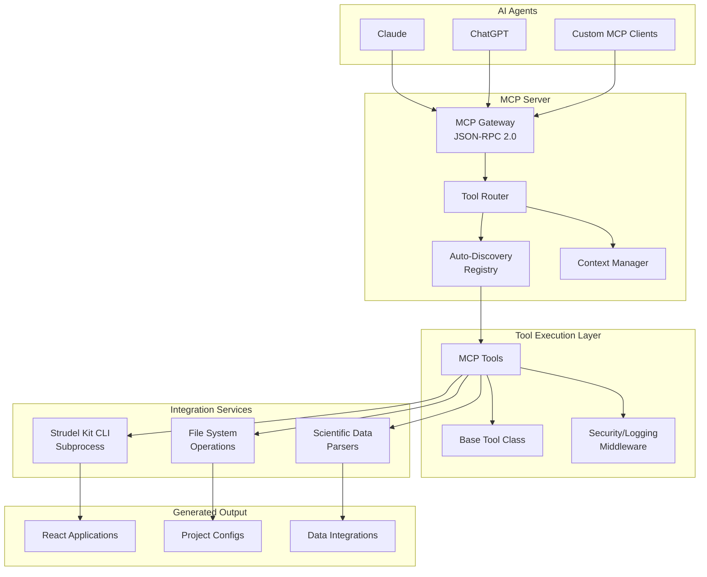

# 7. Technical Architecture

## 7.1 Technology Stack

```
Core Framework:
- xmcp TypeScript Framework (MCP server foundation)
- Node.js 18+ (LTS runtime)
- Express.js 4.x (HTTP server via xmcp)

Development Stack:
- TypeScript 5.0+ (strict mode, comprehensive typing)
- Vitest (testing framework with native TS support)
- ESLint + Prettier (Airbnb TypeScript style guide)
- ESBuild/SWC (fast compilation)

Integration Layer:
- Strudel Kit CLI (subprocess integration)
- Scientific Data Parsers (CSV, JSON, HDF5, NetCDF)
- File System Operations (project scaffolding)

Generated Applications:
- React 18+ (UI framework)
- Strudel Kit Component Library (scientific components)
- TypeScript 5.0+ (type-safe applications)
```

## 7.2 Repository Structure

```
strudel-kit-mcp-server/
├── src/
│   ├── server.ts                    # Main server entry point
│   ├── core/
│   │   ├── registry.ts             # Tool auto-discovery & registration
│   │   ├── router.ts               # MCP request routing
│   │   ├── context.ts              # Execution context management
│   │   └── validator.ts            # Input/output validation
│   ├── middleware/
│   │   ├── auth.ts                 # JWT authentication
│   │   ├── logging.ts              # Structured logging
│   │   ├── rateLimit.ts           # Rate limiting
│   │   └── error.ts                # Error handling
│   ├── tools/                      # MCP tools (auto-discovered)
│   │   ├── base.tool.ts           # Abstract base class
│   │   ├── create-project.ts       # Project creation
│   │   ├── add-task-flow.ts        # Workflow integration
│   │   ├── customize-components.ts # UI customization
│   │   ├── configure-data-source.ts# Data connection
│   │   └── generate-workflow.ts    # Pipeline creation
│   ├── integrations/
│   │   ├── strudel/               # Strudel Kit integration
│   │   │   ├── cli.ts             # CLI wrapper
│   │   │   ├── components.ts      # Component registry
│   │   │   └── templates.ts       # Template management
│   │   └── data/                  # Data processing
│   │       ├── parsers.ts         # Format parsers
│   │       └── validators.ts      # Schema validation
│   └── utils/
│       ├── fileSystem.ts          # File operations
│       ├── process.ts             # Child process management
│       └── cache.ts               # Response caching
├── .agents/                       # Hidden documentation workspace (architecture, PRD shards, stories, QA)
│   ├── architecture/              # Architecture shards
│   ├── stories/                   # Epic and story specs
│   ├── prd/                       # PRD shards
│   ├── qa/                        # QA records and gates
│   └── *.md                       # Top-level indices (architecture.md, prd.md, etc.)
├── tests/                         # Test suites
│   ├── unit/                      # Unit tests
│   ├── integration/               # Integration tests
│   └── e2e/                       # End-to-end tests
├── config/                        # Configuration files
└── package.json                   # Project configuration
```

## 7.3 Integration Architecture



---
